## 1 Instalasi Server

Instalasi mencakup

1. Instalasi web/application server [Apache, NginX]
2. Intalasi database server [MySQL, MariaDB]
3. Instalasi application program [PHP]

Bisa menggunakan paket program seperti **Laragon** atau **XAMPP**. 

- https://laragon.org/download/index.html

- https://www.apachefriends.org/download.html

- Saran: Pilih satu saja, XAMPP atau Laragon.

> [__!TODO__]
> Detailkan langkah-langkah instalasi dengan __capture__  tampilan instalasi dari __komputer Anda masing-masing__. Termasuk jika diminta memasukkan akun dan password untuk Mysql, sampai Anda melihat tampilan bahwa webserver sudah berjalan di komputer Anda. 
> Buatlah capture langkah-langkah tersebut menjadi sebuah tutorial dalam file .md atau .docx agar menjadi portofolio tutorial Anda.

Tutorial instalasi XAMPP:

1. **Unduh XAMPP**: Kunjungi situs resmi XAMPP di https://www.apachefriends.org/download.html dan unduh versi terbaru XAMPP sesuai dengan sistem operasi yang Anda gunakan (Windows, macOS, atau Linux).

2. **Jalankan Instalator**: Setelah selesai mengunduh, jalankan file instalasi yang telah diunduh. Pada Windows, Anda akan melalui proses instalasi standar, ikuti petunjuk yang diberikan oleh instalator.

3. **Pilih Komponen**: Anda akan ditawarkan untuk memilih komponen yang ingin Anda instal. Pastikan Anda memilih Apache, MySQL, dan PHP, karena ini adalah komponen dasar untuk menjalankan aplikasi web.

4. **Pilih Direktori Instalasi**: Pada langkah ini, Anda dapat memilih di mana XAMPP akan diinstal. Secara default, ini akan diinstal di direktori C:\xampp pada Windows.

5. **Selesaikan Instalasi**: Ikuti instruksi pada layar untuk menyelesaikan instalasi. Setelah selesai, pastikan opsi untuk memulai XAMPP Control Panel dicentang jika Anda ingin langsung memulai XAMPP setelah instalasi selesai.

6. **Mulai XAMPP**: Setelah instalasi selesai, jalankan XAMPP Control Panel dari shortcut di desktop atau dari direktori di mana Anda menginstal XAMPP. Klik pada tombol Start untuk memulai Apache dan MySQL. 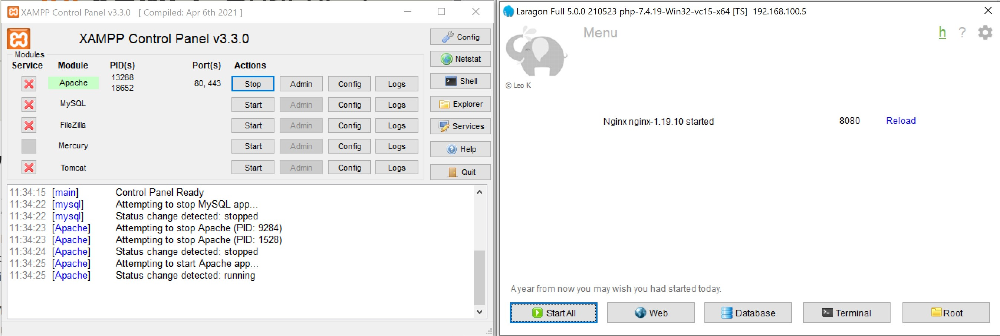

7. **Verifikasi Instalasi**: Buka browser web dan ketikkan `"http://localhost"` atau `http://127.0.0.1` dalam browser. Jika Anda melihat halaman awal XAMPP, berarti instalasi telah berhasil. Ketik URL `localhost:8080` atau `127.0.0.1:8080` untuk server NginX. 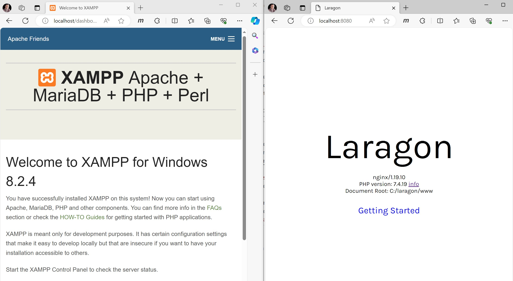

## 2 Periksa versi PHP

#### 2.1. Check versi php dari lokasi instalasi

* Jalankan program terminal atau command. 

* Pindah kursor ke lokasi folder dimana file php.exe disimpan. contoh: 
  `cd C:\xampp\php`

* Ketik perintah `php -v`pada terminal. Lihat hasilnya.
  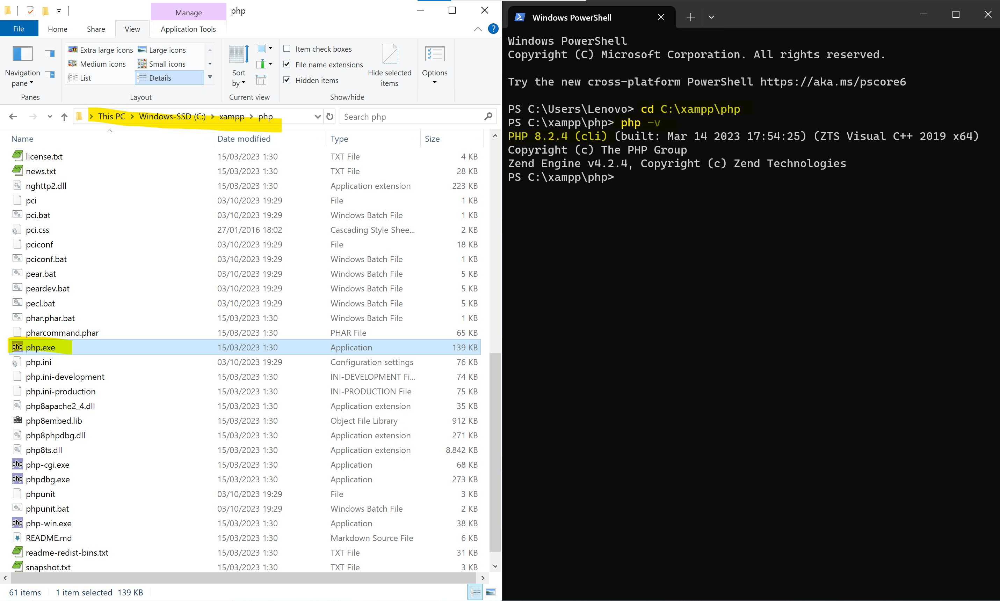

#### 2.2. Check versi php dari lokasi lain.

* Pindahkan lokasi kursor terminal ke folder lain. 
* Contoh, berpindah ke folder `cd D:\20_DEV`
* Ketik perintah `php -v`di lokasi tersebut. Hasilnya harus sama dengan check versi php dari lokasi intalasi PHP. 
* Jika muncul pesan error atau sintak tidak dikenal. Lanjutkan ke tutorial __setting environtment__ variabel.

## 3 Instalasi Composer

__Composer__ adalah aplikasi packet manager seperti XAMPP/Laragon, tetapi diperuntukkan untuk instalasi library atau paket-paket program untuk suatu framework. Misal, kita akan melakukan instalasi framework Laravel, maka library-library yang dibutuhkan oleh laravel, dengan mudah kita install menggunakan composer ini.

Tutorial instalasi Composer menggunakan file exe untuk Windows:

1. **Unduh Composer**: Buka browser web dan kunjungi situs resmi Composer di https://getcomposer.org/download/. Di sana, Anda akan melihat tautan untuk mengunduh __Composer-Setup.exe__.

2. **Jalankan Instalator**: Setelah selesai mengunduh, buka file Composer-Setup.exe yang baru Anda unduh. 

3. **Ikuti Instruksi Instalasi**: Ikuti petunjuk pada layar. Pilih opsi default untuk sebagian besar langkah-langkah instalasi, tetapi pastikan untuk memeriksa opsi `"Add Composer to PATH"` agar Composer dapat diakses dari mana saja melalui `command prompt`.

4. **Selesaikan Instalasi**: Setelah Anda selesai mengikuti semua langkah instalasi, klik tombol "Install" atau "Finish" untuk menyelesaikan instalasi.

5. **Verifikasi Instalasi**: Buka command prompt dan ketik perintah `composer`. Jika instalasi berhasil, Anda akan melihat output yang menampilkan versi Composer yang terinstal. 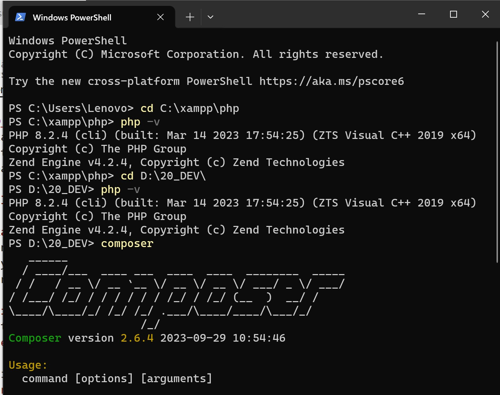

> [__!TODO__]
> Diskusikanlah troubleshoot pada kendala yang terjadi (apabila ada)! 
> Buatlah troubleshoot pada kendala menjadi catatan tutorial portofolio Anda. Simpan dalam file .md atau .docx 

## 4 Instalasi Laravel

#### 4.1. Buka program terminal.

* Arahkan posisi folder lokasi tempat laravel akan di install. Boleh juga dilokasi di web server `laragon\www` atau `apache\htdocs`. 

#### 4.2. Ketik perintah instalasi

* Script instalasi `composer create-project laravel/laravel="versi-spesifik" [nama-folder]`

* Contoh 1 (instalasi laravel versi terakhir):
  `> composer create-project laravel/laravel laravelapsi01`

* Contoh 2 (instalasi laravel versi 10.2):
  `> composer create-project laravel/laravel="10.2" laravelapsi01`. 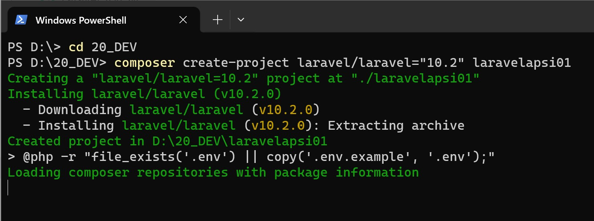

* Tunggu sampai proses download instalasi selesai. Setelah itu, Anda akan melihat ada sebuah folder `laravelapsi01` yang berisi paket-paket library laravel

Selain menggunakan instalasi menggunakan composer, dimana hampir seluruh file aplikasi dan library harus di unduh, dapat juga menjadikan salah satu project menjadi master untuk instlasi. Caranya, dari folder pertama project, jalankan 

* Dari folder pertama project, buka terminal dan jalankan  `composer global require laravel/installer`

* Kemudian untuk membuat project, silahkan tempatkan pointer terminal pada folder dimana laravel akan diinstall.

* Jalankan perintah `laravel new <example-app>`

* Periksa hasilnya dengan masuk ke folder yang telah dibuat tadi, dan jalankan server laravel `php artisan serve`.

#### 4.3. Jalankan Server Laravel

* Ketik perintah `php artisan serve` pada terminal dari lokasi folder `laravelapsi01` berada. 

* Lihat hasilnya pada browser dengan mengakses URL `127.0.0.1:8000`
  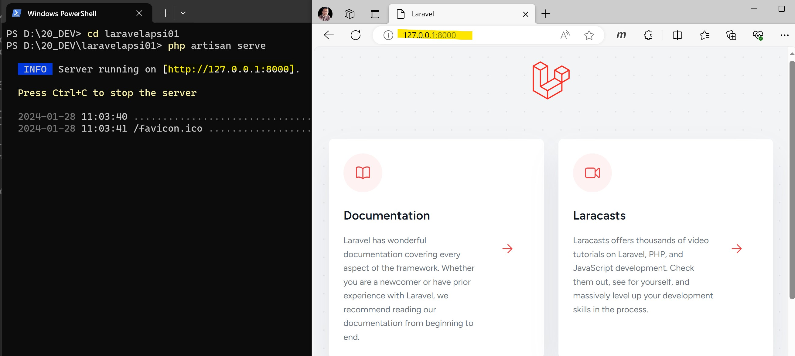

> [__!TODO__]
> Diskusikanlah troubleshoot pada kendala yang terjadi (apabila ada)! 
> Buatlah troubleshoot pada kendala menjadi catatan tutorial portofolio Anda. Simpan dalam file .md atau .docx 

## 5 Setting Environment

Bagi yang mengalami error atau kendala saat check php version dari lokasi folder mana saja, bisa melakukan setting __Environtment variables__.

1. Pada menu pencarian windows, ketik `Environ`, maka akan diarahkan untuk 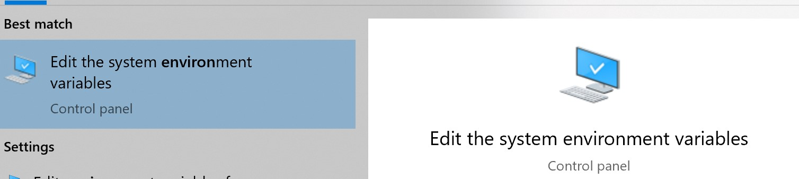

2. Pada tab Advanced, pilih tombol Environment Variabels. 
   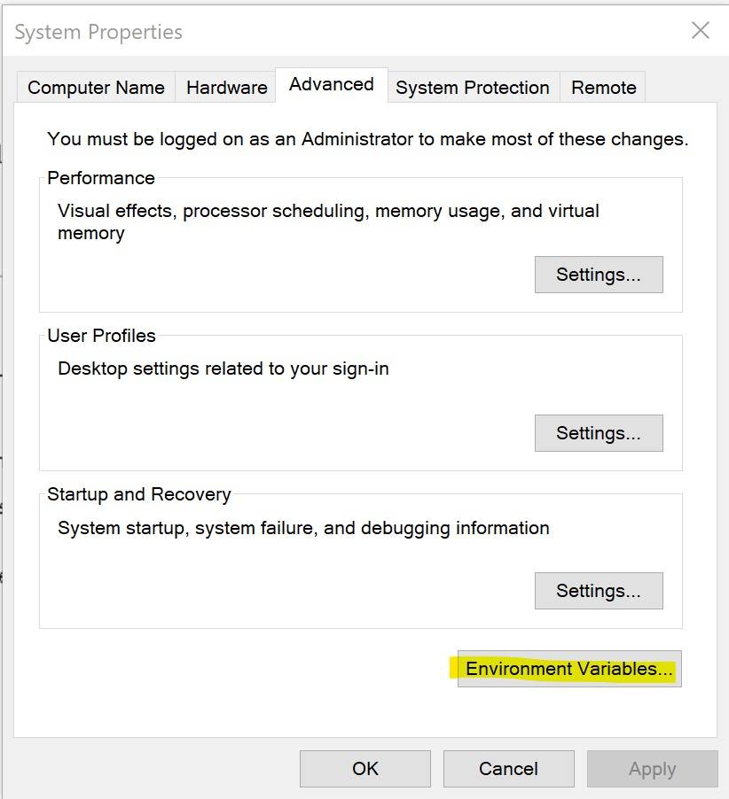

3. Pilih Path, dan pilih tombol Edit.
   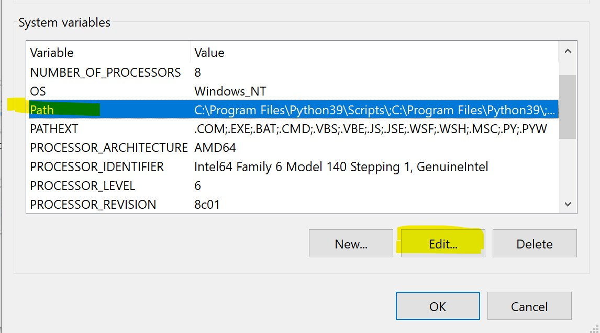

4. Tambahkan Path dimana lokasi PHP.exe berada. Setiap komputer bisa berbeda-beda sesuai proses instalasi.
   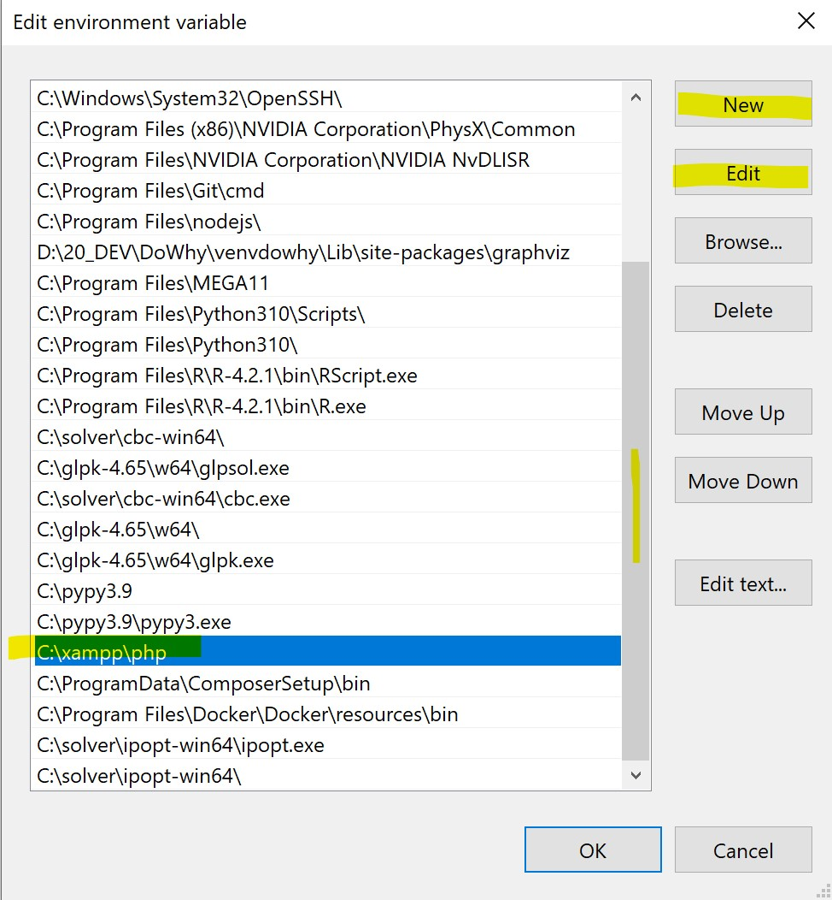

## 6 Instalasi VS-Code dan Ekstensi

**VS-Code** (visual studio-code) adalah editor program yang banyak digunaan untuk mengetik baris-baris program. 
https://code.visualstudio.com/download

**Ekstensi** diperlukan agar memudahkan Anda bekerja membuat baris-baris program. Berikut ekstensi yang sebaiknya ditambahkan.

1. Laravel Extention Pack. Dibuat oleh Winnie Lien.

2. vscode-icons. Dibuat oleh VSCode Icons Team. 

3. Jalankan visual studio code (VS-Code). Pilih Tab Extensions. Kemudian cari extensi `Laravel Extention Pack`, pilih yang dibuat oleh Winnie Lien, kemudian klik tombol install.
   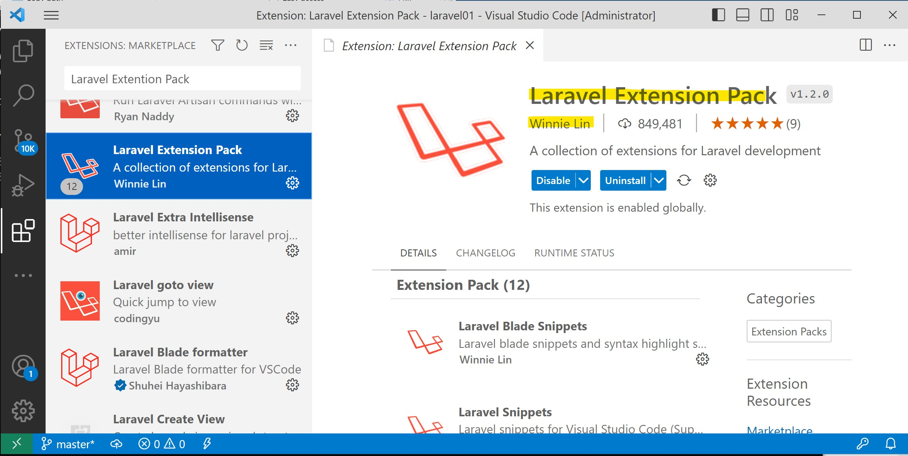

4. Pilih Tab Extensions. Kemudian cari extensi `vscode-icons`, pilih yang dibuat oleh VSCode Icons Team, kemudian klik tombol install
   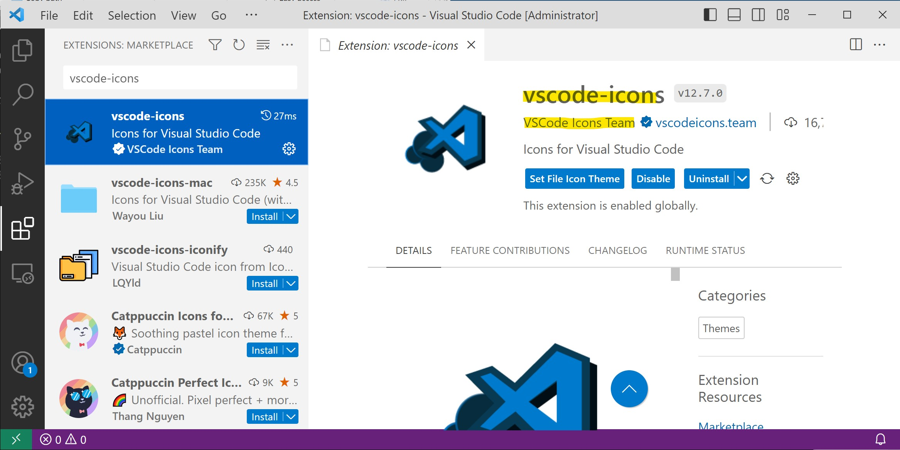

5. Close program VS-Code dan jalankan kembali. Buka menu *File > Open Folder* dan arahkan menuju folder instalasi `laravelapsi01'.

6. Lanjutkan proses praktik membuat website menggunakan Laravel.
