# Praktek Pembuatan Sistem Informasi 01

Tutorial dimulai dari membuat projek baru menggunakan Laravel dan Paket Authentikasi Laravel UI (Bootsrtap)

## 1. Membuat Projek 

1. Buka __terminal__, posisikan direktori. misal `d:\20_DEV`

2. Buat projek baru dengan perintah dasar `composer create-project laravel/laravel="10.2" apsi-capstone`, atau `laravel new apsi-capstone` 

3. Melalui terminal, masuk ke folder _apsi-capstone_. contoh `cd apsi-capstone`.

4. Instalasi modul Laravel UI. `composer require laravel/ui`

5. Lanjutkan install modul authentikasi. `php artisan ui bootstrap --auth`.
    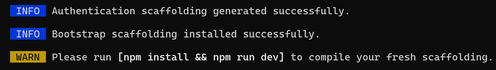

6. Menggunakan terminal, jalankan perintah `npm install`

7. Jalankan perintah __`npm run dev`__. 
    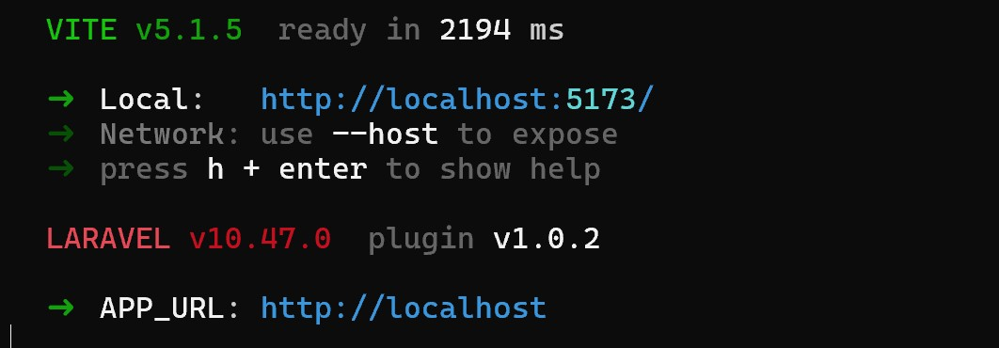

8. Buka lagi sebuah __terminal__ , dan jalankan server laravel. `php artisan serve` (npm run dev harus tetap jalan pada terminal yang lain). Lihat hasil pada browser, tampilan awal Laravel saat ini sudah dilengkapi menu untuk __Login__ dan __Register__.
    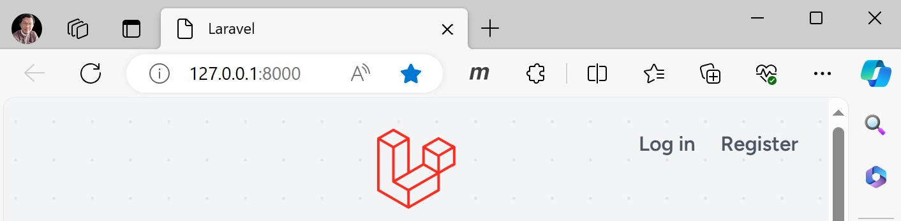
    dan 
    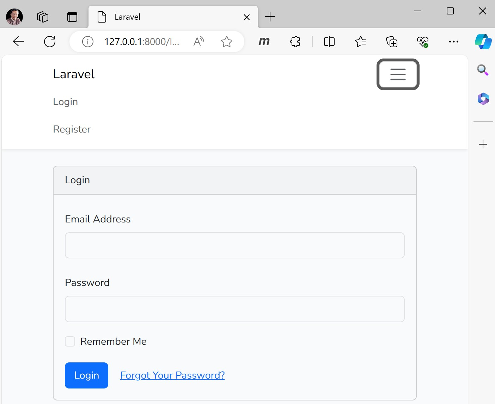
    Sampai sesi ini, antarmuka sudah jalan. Pada windows, kedua perintah harus dijalankan.

## 2. Mengaktifkan Database

1. Jalankan database server, misal melalui XAMPP. Buat sebuah database dengan nama __apsi_capstone__.
    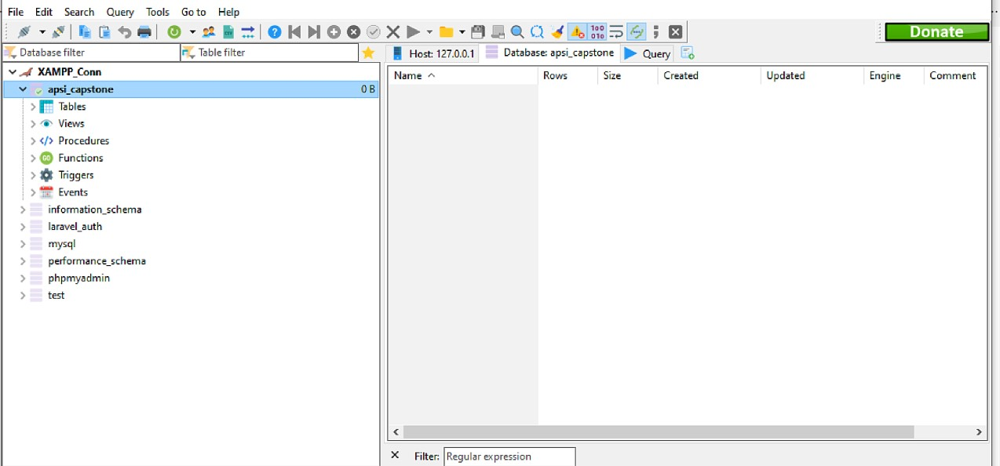

2. Buka file __.env__ di folder laravel, ubah setting nama database menjadi `DB_DATABASE='apsi_capstone'`. Kosongkan password jika koneksi ke database tidak menggunakan password, atau isikan sesuai password yang telah di atur pada saat instalasi XAMPP.

3. Buka __terminal__ dan jalankan perintah `php artisan migrate:fresh`. Proses ini melakukan migrasi tabel users dan beberapa table lain yang terdapat pada folder `\database\migrations`
    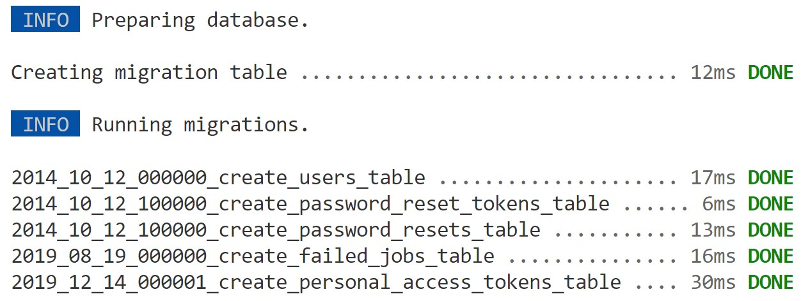

4. Lakukan **registrasi user**. Misal, saya menggunakan email **priandari@gmail.com** dan password **authpriandari**. Hasilnya langsung diarahkan ke halaman dashboard jika berhasil.
    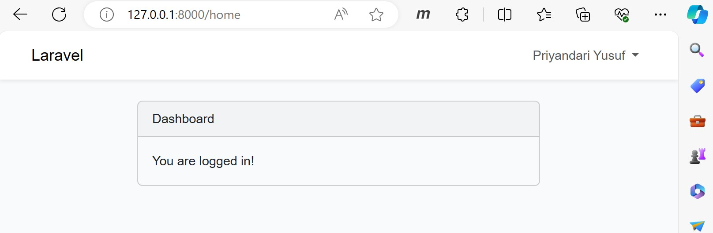


Bagian berikut ini sedikit penjelasan mengenail Routes, Controller, Model dan View dari proses pembuatan project menggunakan modul Laravel UI dan Bootstrap --auth.

## 3. Meninjau Routes

1. Buka file __routes__ `web.php`. Ada tiga buah routes yang terbentuk, salah satunya adalah `Auth::routes();` yang merupakan kumpulan dari sejumlah routes.
   
   ```php
   use Illuminate\Support\Facades\Route;
   use Illuminate\Support\Facades\Auth; // Opsional ditambahkan agar Auth::routes() tidak dibaca warning oleh VsCode.
   
   Route::get('/', function () {
       return view('welcome');
   });
   
   Auth::routes();
   
   Route::get('/home', [App\Http\Controllers\HomeController::class, 'index'])->name('home');   
   ```

2. Ketik pada __terminal__ `php artisan route:list --except-vendor`, maka ada total 14 routes, dimana dua diantaranya sudah terlihat yakni `/` dan `/home`. Sisanya diwakili oleh `Auth::routes();`
    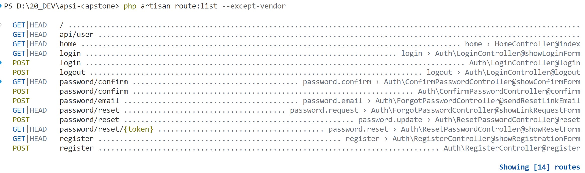


3. Routes yang perlu anda cermati adalah `/login`, `/logout`, `/password/confirm`, `pasword/email`, `password/reset`, dan `/register`.

## 4. Meninjau Controller

1. Buka file `app\Http\Controllers\HomeController.php`.
   
   ```php
   namespace App\Http\Controllers;
   use Illuminate\Http\Request;
   
   class HomeController extends Controller
   {
       /**
       * Create a new controller instance.
       * @return void
       */
       public function __construct()
       {
           $this->middleware('auth');
       }
   
       /**
       * Show the application dashboard.
       * @return \Illuminate\Contracts\Support\Renderable
       */
       public function index()
       {
           return view('home');
       }
   }
   ```

2. Ada sebuah fungsi `function __construct()`. Di dalamnya terdapat baris perintah `$this->middleware('auth')`. Ini artinya  method atau fungsi di dalam HomeController hanya bisa diakses jika telah login.

3. Jika ingin mengatur satu persatu fungsi yang bisa diakses setelah login, maka tidak perlu membuat function __construct() yang berisi baris `$this->middleware('auth')`, Tetapi menuliskan  `$this->middleware('auth')` pada setiap fungsi yang bisa diakses setelah login.

4. Saat awal hanya ada `function index()`. Fungsi ini memanggil halaman `view('home')` yang menghasilkan tampilan dashboard paska proses login.

> Controller lainnya terdapat pada folder Auth, yang merupakan hasil instalasi `--auth`.

> Pelajari secara singkat file _LoginController.php_ yang mengatur ke view mana paska login, dan _RegisterController.php_ yang mengatur default jika sukses register dan fungsi membuat (create) _data user_ dengan memanggil _model User_. 

## 5. Meninjau Model

1. Buka file `app\Models\User.php`.
   
   ```php
   namespace App\Models;
   // use Illuminate\Contracts\Auth\MustVerifyEmail;
   use Illuminate\Database\Eloquent\Factories\HasFactory;
   use Illuminate\Foundation\Auth\User as Authenticatable;
   use Illuminate\Notifications\Notifiable;
   use Laravel\Sanctum\HasApiTokens;
   
   class User extends Authenticatable
   {
       use HasApiTokens, HasFactory, Notifiable;
   
       /**
       * The attributes that are mass assignable.
       * @var array<int, string>
       */
       protected $fillable = [
           'name',
           'email',
           'password',
       ];
   
       /**
       * The attributes that should be hidden for serialization.
       * @var array<int, string>
       */
       protected $hidden = [
           'password',
           'remember_token',
       ];
   
       /**
       * The attributes that should be cast.
       * @var array<string, string>
       */
       protected $casts = [
           'email_verified_at' => 'datetime',
           'password' => 'hashed',
       ];
   }
   ```

2. Ada tiga _assigment properti_ pada model `User`. ketiganya adalah
   
   + __protected $fillable__. Mendifinisikan kolom yang boleh diisi hanya `name, email dan password` pada saat melakukan __Insert__ data. Fields atau atribut lain akan dibuat otomatis oleh sistem.  
   
   + __protected $hidden__. Mendefinisikan field atau kolom yang tidak tertampil seandainya diakukan pemanggilan data untuk semua kolom menggunakan fungsi `User::all()`.
   
   + __protected $casts__. Mengkonversi nilai tipe data. Dalam hal ini data dari field  `email_verified_at` diubah menjadi `datetime`, dan `password` diubah menjadi __terenkripsi__.

## 6. Meninjau View

1. Buka folder `resources\views`.
    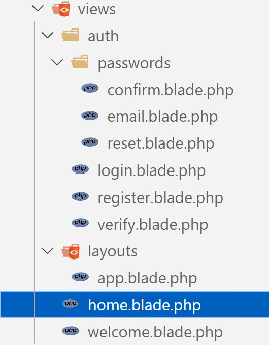

2. Route dengan alamat url `/` mengarahkan respon ke view `welcome.blade.php`. 

3. Kemudian url `/home` mengatur menuju controller `HomeController.php`. Hanya saja, fungsi-fungsi pada `HomeController.php` harus melewati proses authentikasi `middleware('auth')` yang didefinisikan pada `fungsi __construct()` atau harus __login__. Itulah mengapa ketika kita mencoba akses langsung ke `/home` selalui dilempar ke halaman `view(login)`.

4. Pada views juga telah dibuatkan layout `app.blade.php` sebagai template utama, yang di __extend__ oleh view('welcome') dan view('home'). 
    >[TIP] Buka kembali tutorial tentang layout.

5. Pada folder auth, terdapat file view login.blade.php, register.blade.php dan verify.blade.php. Anda tidak perlu melakukan modifikasi pada bagian ini.

6. Di dalam folder auth ada lagi folder passwords yang berisi beberapa file view.

-----------------------

## 7. Menambahkan Menu Data User

1. Buka file layout __app.blade.php__ tambahkan menu Data User yang tampil jika pengguna sudah login. Blok program di antara @auth ... @endauth akan ditampilkan jika pengguna sudah login.  Blok program di antara @guest ... @endguest akan ditampilkan jika pengguna belum login.
    ```html
    <!-- Left Side Of Navbar -->
    <ul class="navbar-nav me-auto">
    @guest
        <li class="nav-item">
            <a class="nav-link" href="{{url('/about')}}">About</a>
        </li>
    @endguest

    @auth
        <li class="nav-item">
            <a class="nav-link" href="{{url('/user')}}">Data User</a>
        </li>
    @endauth
    </ul>
    ```
2. Pada bagian lain file `app.blade.php` terdapat bagian menampilkan nama pengguna jika sudah login. Pada bagian lain yang berisi `@yield('content')` tentunya dipahami sebagai tempat menampilkan @section('content') dari file lain ke dalam template ini. 

3. Akses alamat URL /login dan lihat hasil bagian atas, Ada menu About. 
    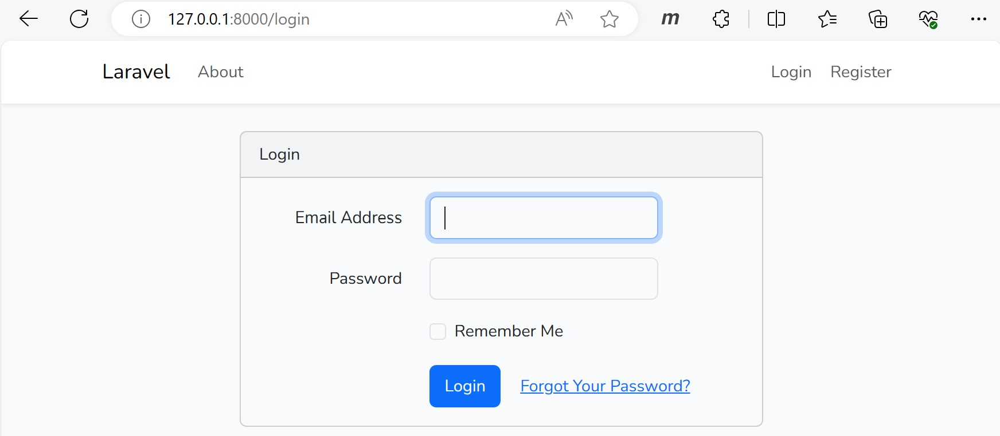

4. Jika sudah login, akan ada menu Data User.
    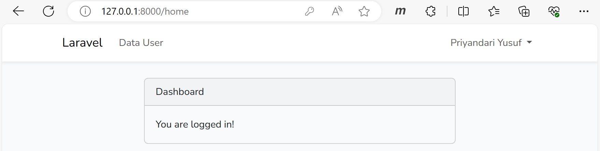
    Selain itu, jika sudah Login juga ditampilkan Nama pengguna, dan menu Logout.
    > Cermati isi file layout `app.blade.php`.

## 8. Menampilkan Data User

Anda akan menampilkan data pengguna yang login.

1. Tambahkan sebuah baris routes pada file `web.php` sebagai berikut.    
    ```php  
    Route::get('/user', [App\Http\Controllers\UserController::class, 'index'])->name('user');
    ```
    Alamat URL tersebut akan memanggil UserController.php.

2. Buat controller menggunakan __terminal__  dengan perintah `php artisan make:controller UserController`

3. Buat fungsi index() pada `UserController.php`, dan tambahan penggunaan Facades Auth. 
    ```php
    // Tambahkan
    use Illuminate\Support\Facades\Auth; //Auth ada fungsi menarik data

    public function index()
    {
        echo Auth::user()->id."<br>";
        echo Auth::user()->name."<br>";
        echo Auth::user()->email."<br>";
        echo Auth::user()->password."<br>";
        dump(Auth::user());
    }
    ```
    
4. Kemudian login, klik menu Data User, Lihat dan pelajari dahulu hasilnya.
    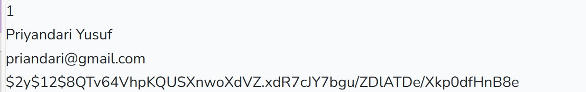
    
    Hasil proses dump
    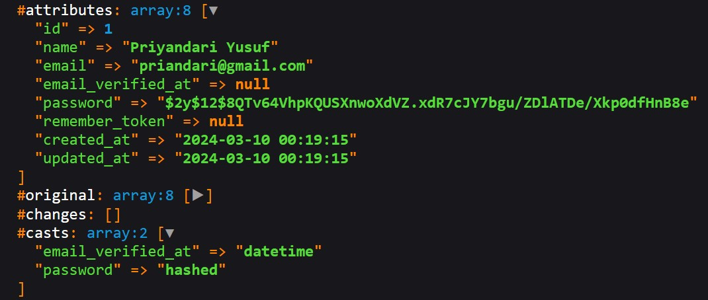

----------------------------------
5. Selain menggunakan Auth, __user yang sedang login juga dapat diketahui__ menggunakan facades __Request__. Pada UserController.php buat fungsi datauser(). 
    ```php
    public function dataUser(Request $request)
    {
    echo $request->user()->id."<br>";
    echo $request->user()->name."<br>";
    echo $request->user()->email."<br>";
    echo $request->user()->password."<br>";
    }
    ```

6. Tambahkan sebuah route. 
    ```php
    Route::get('/user-data', [App\Http\Controllers\UserController::class, 'dataUser'])->name('user_-_data');
    ```

7. Lihat pada url `/user-data` dan pelajari dahulu hasilnya.
    

--------------------------------------------
8. Lanjutkan membuat file `user.blade.php`, isinya sebagai berikut.
    ```html
    @extends('layouts.app')
    @section('content')
    <div class="container">
        <div class="row justify-content-center">
            <div class="col-md-8">
                <div class="card">
                    <div class="card-header">{{$judul}}</div>
                        <div class="card-body">
                            <p>Tempat Data User</p>
                            Nama : {{$datauser['name']}}
						    <br>
						    Email : {{$datauser['email']}}
                        </div>
                    </div>
                </div>
            </div>
        </div>
    </div>
    @endsection
    ```

9. Modifikasi fungsi __dataUser__ pada UserController. 
    ```php
    public function dataUser(Request $request)
    {
        if(Auth::check())
        {
            return view('userdata',['judul'=>'Data User', 'datauser'=>$request->user()]);
        }
        else
        {
            return view('userdata',['judul'=>'Silahkan login terlebih dahulu']);
        }
        
    }
    ```
10. Kemudian lihat hasilnya pada URL `/user-data` setelah login.
    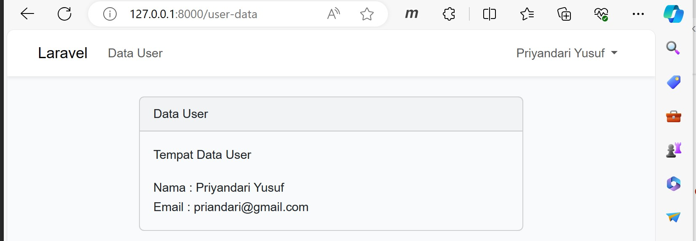
