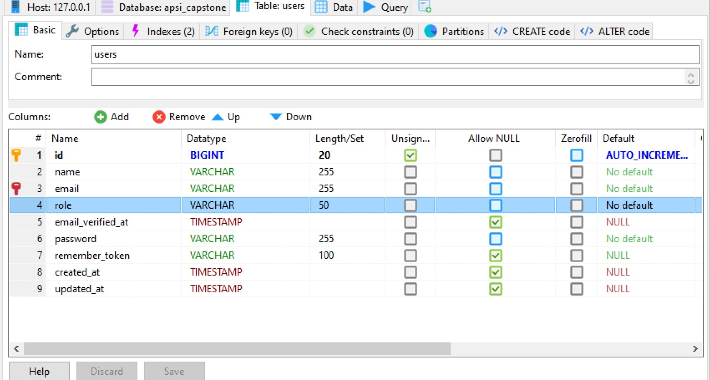
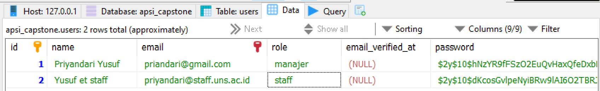
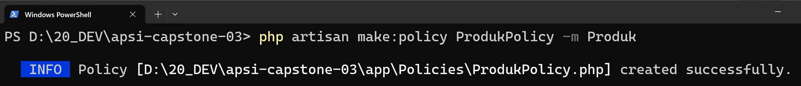

# Praktek Pembuatan Sistem Informasi 03

Praktek sebelumnya membuat CRUD, bagian ini mengatur user dengan kategori tertentu yang berhak melakukan Create, Read, Update, Delete menggunakan fitur _policy_. __Policy adalah__ pengaturan yang dipakai untuk __membatasi hak akses user terhadap sebuah model__. Pengaturan agar pengguna dengan property tertentu, misal kategori tertentu, atau email tertentu yang boleh melakukan akses kepada model tabel tertentu.

__Policy berbentuk class__ yang disimpan dalam file khusus (mirip seperti file controller, file model). 

## 1. Persiapan: 
### 1.1 Menambah atribut role pada Tabel Users
1. Tambah atribut `role` pada tabel user
    

2. Mengisi data atribut role dengan data manajer dan staff pada setiap user yang sudah ada dalam tabel.
    

### 1.2 Memodifikasi Model User
    ```php
    protected $fillable = [
            'name',
            'email',
            'role',
            'password',
        ];
    ```
### 1.3 Memodifikasi RegisterController
1. Tambahkan atribut role dengan isian data default berupa staff. Letak file `app\Http\Controllers\Auth\RegisterController.php`
    ```php
    protected function create(array $data)
        {
            return User::create([
                'name' => $data['name'],
                'email' => $data['email'],
                'role' => 'staff',
                'password' => Hash::make($data['password']),
            ]);
        }
    ```
2. Penjelasan: Artinya setiap terjadi register, user otomatis berperan sebagai staff.

## 2. Membuat Policy terhadap Model Produk Menggunakan Migration 

__Policy berbentuk class__ yang disimpan dalam file khusus (mirip seperti file controller, file model). 

### 2.1. Membuat file policy bagi Model Produk sebagai berikut.
1. Perintah yang digunakan pada terminal.

    `php artisan make:policy <NamaPolicy> -m NamaModel`

    `php artisan make:policy ProdukPolicy -m Produk`

    

2. Terbentuk file `app/Policies/ProdukPolicy.php` yang berisi 7 pasangan fungsi policy terhadap fungsi controller sebagai berikut
    | Policy Method | Controller Method |
    |---------------| -----------------:|
    | viewAny()     | index()           |
    | view()        | show()            |
    | create()      | store()           |
    | update()      | update()          |
    | delete()      | destroy()         |
    | restore()     | restore()         |
    | forceDelete() | forceDelete()     |

__Prinsipnya semua pengguna tidak boleh, kecuali yang diberi akses atau ditulis pada policy__

### 2.2. Pengaturan Awal pada File ProdukPolicy.php
1. Set semua fungsi memberikan return true dahulu pada policy, contoh.
    ```php
        public function view(User $user, Produk $produk): bool
        {
            return true;
        }     
    ```
2. Lakukan hal di atas untuk semua fungsi

## 3. Pengaturan Hak Delete
1. Atur agar hanya pengguna __manajer__ yang didefinsikan pada fungsi delete() di policy yang boleh menghapus
    ```php
        public function delete(User $user, Produk $produk): bool
        {
            // Khusus delete, hanya pengguna yang tertulis yang dibolehkan
            return $user->role === 'manajer';
            // return $user->email === 'priandari@gmail.com';
        }
    ```

2. Atur hak tersebut pada ProdukController, fungsi destroy()
    ```php
        public function destroy(Produk $produk)
        {
            // Pembatasan hak akses atau policy
            $this->authorize('delete',$produk);
            
            // Lanjutan blok program tetap

        }
    ```

3. Coba login sebagai pengguna, misal priyandari@staff.uns.ac.id, lakukan proses Hapus. Maka akan muncul pesan 403 Unauthorize karena __role user ini bukan sebagai manajer__.

    > Hak akses ini bisa dibuat lebih spesifik, misal user dengan email tertentu, bukan berbasis atribut 'role' dari tabel users. 

## 4. Pengaturan Hak Create
1. Atur agar hanya pengguna yang didefinsikan pada fungsi create() di policy yang boleh menambah data
    ```php
    public function create(User $user): bool
    {
        // Gunakan in_array jika lebih dari satu peran yang boleh melakukan hak akses
        // return in_array($user->email,['user@gmail.com']);
        return in_array($user->role,['manajer', 'staff']);
    }    
    ```

2. Atur hak tersebut pada ProdukController, fungsi store()
    ```php
        public function store(Request $request)
        {
            // Pembatasan hak akses atau policy
            $this->authorize('create',Produk::class);
            
            // Lanjutan blok program tetap

        }
    ```

3. Coba login sebagai pengguna, misal priyandari@staff.uns.ac.id, lakukan proses menambah Produk, maka bisa dilakukan. Kecuali dihapus role staff pada fungsi create(), maka  pesan 403 Unauthorize akan terjadi karena hanya __role sebagai manajer yang boleh menambah data__.


## 5. Pembatasan Melalui Tampilan Tombol sesuai Hak Akses
__Blade__ memiliki fitur pembatasan tampilan menggunakan perintah `@can ... @endcan` dan` @cannot ... @endcannot`

1. Pastikan pada policy create() telah diatur siapa yang boleh menambah data.
    ```php
        public function create(User $user): bool
        {
            // Gunakan in_array jika lebih dari satu peran yang boleh melakukan hak akses
            return in_array($user->role,['manajer', 'staff']);
        }    
    ```

2. Tambahkan sintaks pengaturan hak akses tampilan pada view. Contoh:
    ```php
        @can('create', App\Models\Produk::class)
        <p>Bagian ini hanya bisa dilihat yang memiliki hak akses create produk</p>
        @endcan
    ```

3. Sebaliknya, penggunaan` @cannot .. @cannot` digunakan untuk yang tidak boleh.                                                       

## 6. Pembatasan melalui Route
Misalkan, pengguna dengan role sebagai staff, dan manajer yang boleh melihat detail data atau view.
1. Tambahkan pengaturan peran view ke policy
    ```php
        public function view(User $user, Produk $produk): bool
        {
            // return in_array($user->email,['user@gmail.com']);
            return in_array($user->role,['manajer','staff']);
            // Jika semua pengguna boleh, maka set return true seperti semula
        }
    ```

2. Modifikasi Route dengan menambahkan :
    ```php
    Route::get('produks/{produk}',[ProdukController::class,'show'])
    ->name('produks.show')->middleware('can:view,produk');
    ```
    _chaining_ pemanggilan method tersebut ke dalam route: `->middleware('can:<nama_method_policy>,<class_model_yang_dibatasi>')`


## 7. Praktek Mandiri (Tugas)
> [TODO]: Buat modul program untuk mengubah role pada tabel user, sehingga user yang saat register pertama kali berperan sebagai staff, dapat ditingkatkan/diubah perannya menjadi manajer, atau sebaliknya ada manajer yang diubah perannya menjadi staff. 

> Ketentuannya tentu saja yang boleh melakukan tugas ini hanyalah user yang sejak awal sudah berperan sebagai manajer.

> Ketentuan lainnya adalah user manajer yang sedang login tidak bisa menurunkan perannya menjadi staff. Jika akan diturunkan perannya, haruslah oleh manajer lain.  
